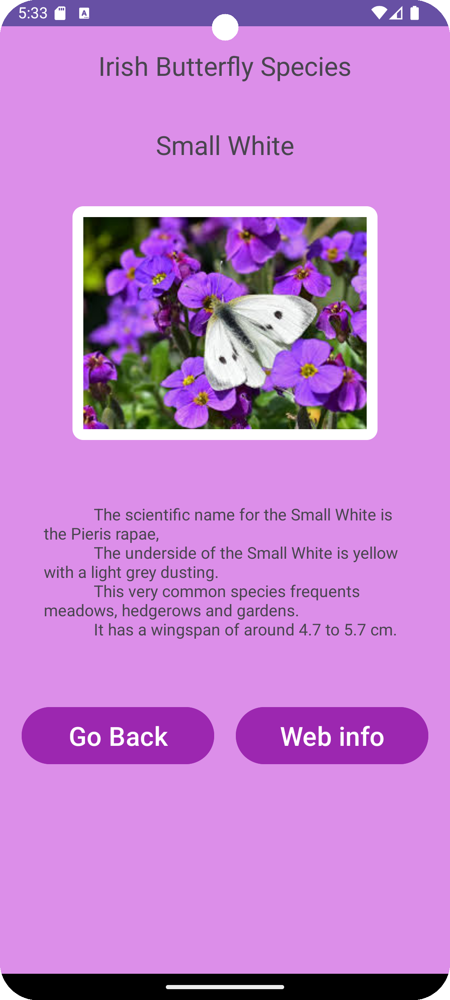

# Multi Activity App (Butterfly App🦋)- README
## Peace Samuel

### Table of Contents
1. App Overview
2. Data Classes and XML
3. Activity Functionality
4. Technical Contribution
5. Design Contribution

### 1. App Overview
The assignment required the development of a four activity Android app to present members of a group. This Butterfly App is an Android app that presents a list of Butterfly species in Ireland, the four activities within this app include:
* Activity 1 ==> Present the Butterfly list as a RecyclerView
* Activity 2 ==> Give some details, an image and some text
* Activity 3 ==> Give more details (with an image)
* Activity 4 ==> Present some web information

### 2. Data Classes and XML
#### Data Classes
The data for the butterflies is stored in an xml file `butterfly_data.xml`. This file contains information about each butterfly, such as:
* Name
* Image
* Description1 & 2
* Web url
* Size
<p> The `Butterfly` class is responsible for dealing with / defining the attributes for each butterfly.</p>

#### XML Parsing
The `XMLButterflies` class is responsible for parsing the XML file using a `DocumentBuilder` to extract butterfly data and store a list of `Butterfly` objects.

##### Example Butterfly Data in XML file:
```
<butterflies>
    <butterfly>
        <name>Small White<\name>
        <image>@drawable/small_white.jpg<\image>
        <description1>The Small White is a small butterfly species in Ireland<\description1>
        <description2>The scientific name for the Small White is the Pieris rapae,..........<\description2>
        <url>https://....</url>
        <size>5<\size>
    <\butterfly>
<\butterflies>
```

### 3. Activity Functionality
#### Main Activity (RecyclerView)
This is the landing screen, which displays the list of the Butterflies using a Recycler View. There is also a Spinner to sort the list either alphabetically or by butterfly size, and Favourite buttons to allow the user to set certain butterflies as favourites. Clicking on a butterfly takes the user to the next Activity to view more details.

#### Butterfly Activity
When a Butterfly is clicked in the Main activity, the next activity displays more details about the selected butterfly (name, image, details). It also has two buttons 'go back' to return to the previous activity and 'more info' to move to the next activity.

#### Details Activity
This activity provides additional details about the selected Butterfly. It also includes a 'go back' button and a 'web info' button to go to the fourth activity which loads a web view.

#### Web Activity
The final activity loads a WebView that shows related information about the butterfly.

### 4. Technical Contribution
* <u>Spinner Sorting functionality</u>: the spinner in the main activity allows users to sort the Butterflies alphabetically or by size. This was implemented using an `ArrayAdapter` and `OnItemSelectedListener`, it modifies the order of item in the `RecyclerView`
Alphabetic sort: `Collections.sort(butterflies.getButterflies())`
* <u>Favourites Feature</u>: The main activity also includes a favourites button that allows users to mark certain butterflies as their favourites. The state fo the favourites is maintained in the app (wanted to try to save between sessions)

### 5. Design Contribution
#### Layout folder:
* activity_main.xml => recycler view & spinner
* activity_butterfly_details2.xml => more butterfly info & navigation buttons
* activity_web.xml => webview
* activity_butterfly.xml => butterfly info & navigation buttons
* row_layout.xml => layout for the rows of butterflies
#### Drawable folder:
Each butterfly has an associated image in the drawable folder. It also has some xml files for the card background used in the Row layout in the RecyclerView.
#### Values folder:
Contains an `color.xml`, `string.xml` file.
### Screenshots of Butterfly App




